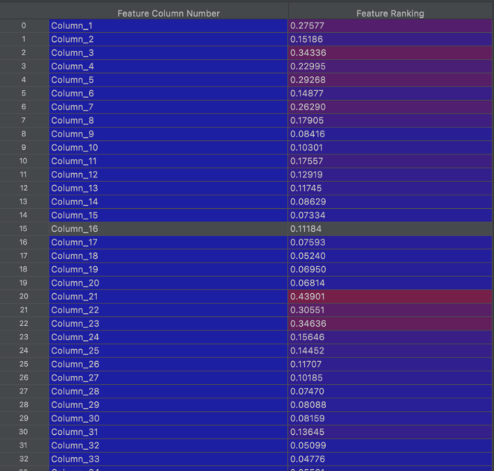
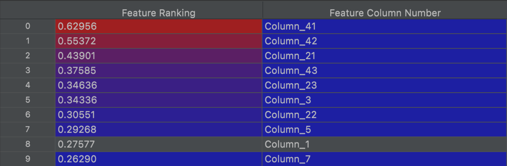
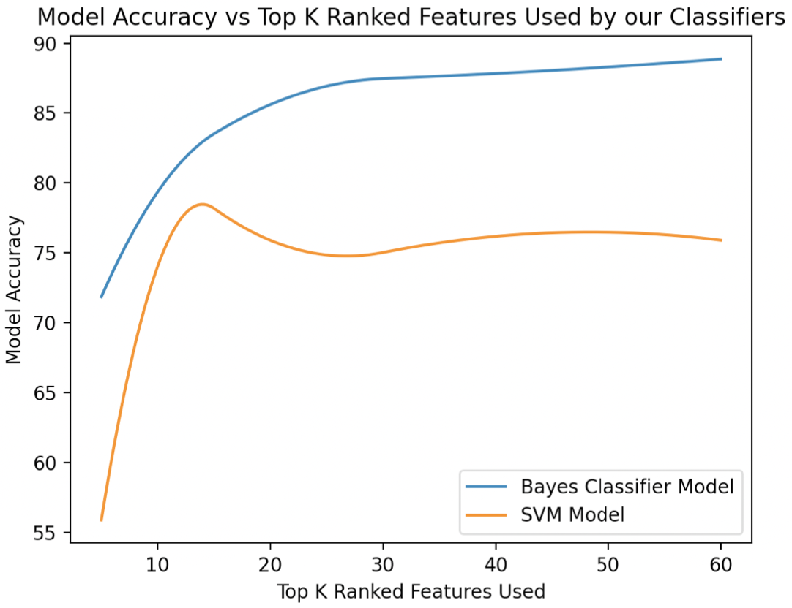
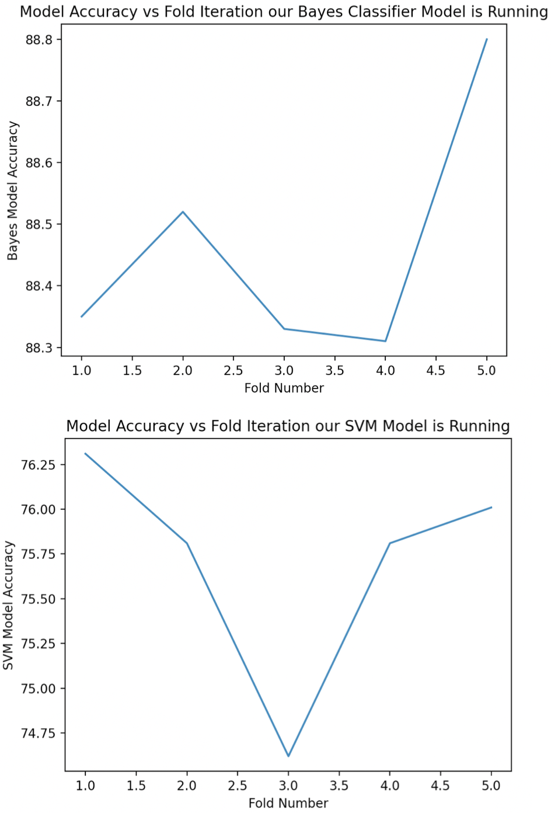
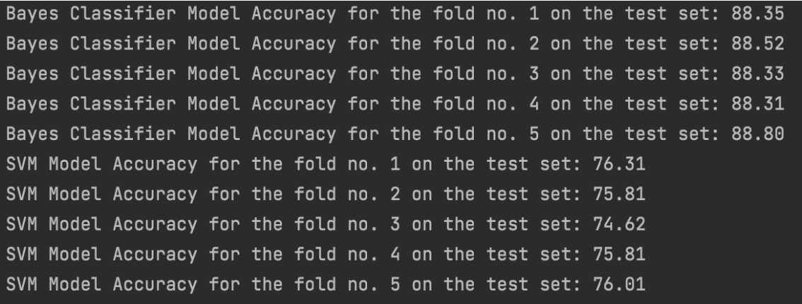

# MNIST-DataAnalysis-ML
#### Author: Wael Khalil

## Program Purpose
This project leverages various ML techniques to analyze the MNIST dataset and determine the top k features used for our classification.


## Running this Project
Note: This program is built using Python 3.7 or later. The IDE used while building it is PyCharm CE.

1. Download and install `Python version 3.7 or later` on your machine.
2. Unzip the data file included in *Features42k.csv.zip*
3. Keep data file in the same directory as *main.py*
4. Navigate to the [ml_project]() directory
5. Run the program as a module with real inputs: `python3 -m ml_project`

## Project Breakdown
In this project, the following **Pre-Processing Methods** are implemented:
- Outlier Removal
- Feature Ranking & Selection

**ML Techniques** Used:
- Bayes Classifier
- SVM with Polynomial Kernel

Also, the ML techniques shown above were then repeated while performing 5-Fold Cross Validation on our data.
<br>

## Project Usage
```commandline```
Usage: python3 -m ml_project

Positional Arguments: None

Optional Arguments: None

## Project Layout
* MNIST-DataAnalysis-ML/: 
  `This is the parent or "root" directory containing all the files below.`
    * README.md
      `The guide you are currently reading.`
    * ml_project/:
      `This is our module that holds all our python scripts and our entry point to the program.`
      * __init__.py 
        `This file is used to expose what functions, variable, classes, etc are exposed when scripts import this module.`
      * __main__.py 
        `This file is the entrypoint to our program when ran as a package.`
      * Features42k.csv.zip
        `The zip file that contains our MNIST numerical dataset, and which our program will use.`

## Sample Results Overview

#### Feature Ranking



#### Top 10 Features and their Corresponding Scores


#### Model Accuracy vs Top K Features Used 


#### Model Accuracy Values with Various Top K Features


#### Bayes and SVM Classifier Model Accuracy vs Fold Iteration


#### Fold Number Model Accuracy Values


